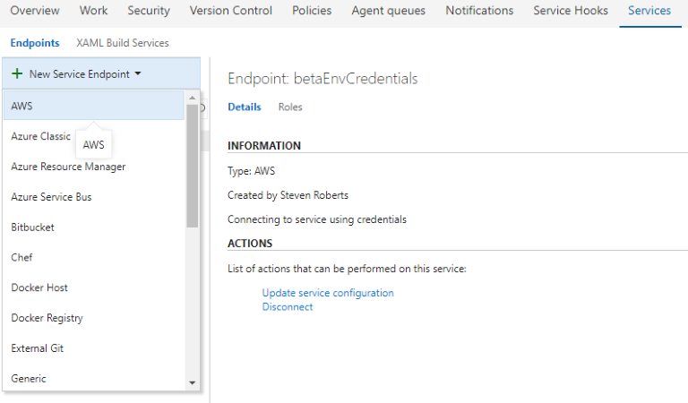
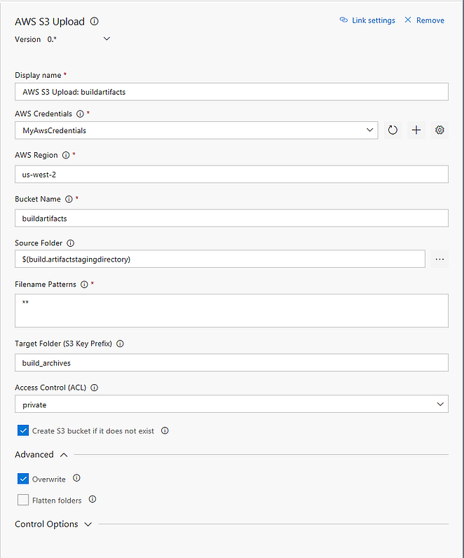
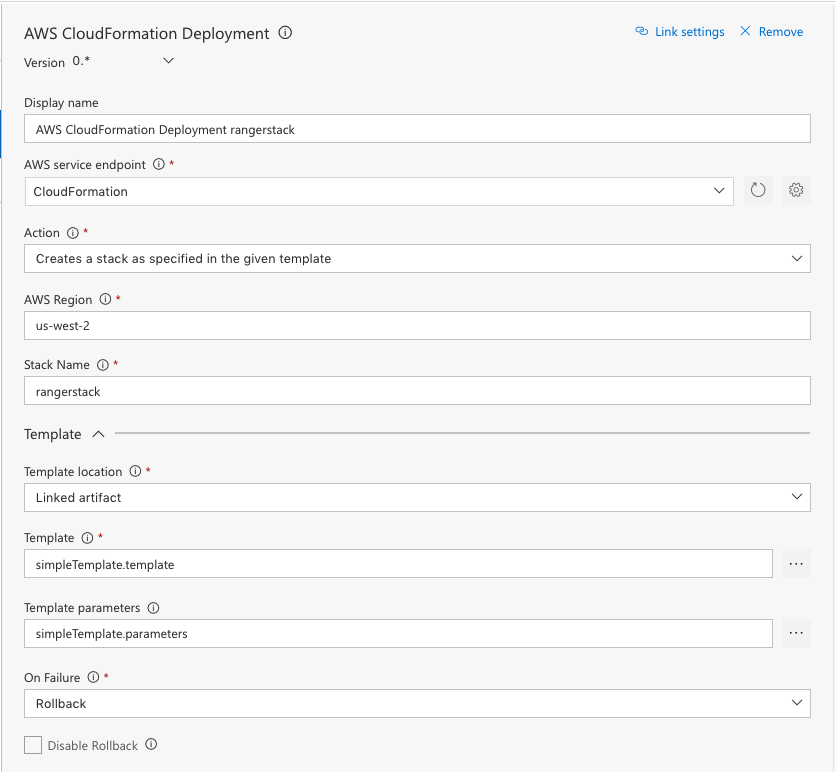
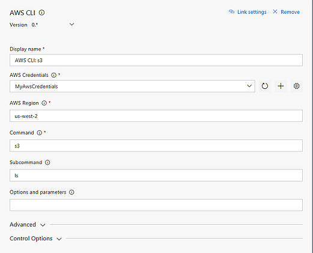

## Overview
Delivering support for a service endpoint, task to upload artifacts to AWS S3 bucket, task to run AWS CLI commands, and other interesting CI/CD tasks.

## Highlighted Features 
### Create an AWS Connection
To deploy to AWS, an AWS subscription has to be linked to Team Foundation Server or to Visual Studio Team Services using the Services tab in the Account Administration section. Add the AWS subscription to use in the Build or Release Management definition by opening the Account Administration screen (gear icon on the top-right of the screen) and then click on the Services Tab. 
- Use 'AWS' endpoint type, provide the following parameters 
- Access Key ID	
- Secret Access Key
- AWS region name

Please refer to [About Access Keys](https://aws.amazon.com/developers/access-keys/)

### Upload Files to AWS S3 Bucket

Upload files to AWS Simple Storage Service (S3) Bucket

### Create and delete AWS CloudFormation stacks

Create and delete AWS CloudFormation stacks

### Run AWS CLI commands

Run a Shell or Batch script with AWS CLI commands against an AWS connection

## Minimum supported environments
- Visual Studio Team Services
- Team Foundation Server 2015 Update 3 (or higher)

## Contributors
We thank the following contributor(s) for this extension: Hosam Kamel, Igor Macedo, Shmulik Ahituv, Giulio Vian