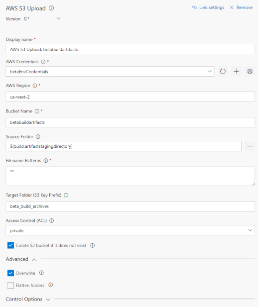

## Overview
The AWS Tools for Microsoft Visual Studio Team Services adds tasks for use to easily enable Team Services pipelines to work with AWS services including Amazon S3, AWS Elastic Beanstalk, AWS CodeDeploy, AWS Lambda, AWS CloudFormation, Amazon Simple Queue Service and Amazon Simple Notification Service, and run commands using the AWS CLI and Tools for Windows PowerShell module. The tools include a new service endpoint type, *AWS*, to supply AWS credentials to the tasks at runtime.

## Highlighted Features
### Create an AWS Credentials Connection
To work with AWS services an AWS subscription has to be linked to Team Foundation Server or to Visual Studio Team Services using the Services tab in the Account Administration section. Add the AWS subscription to use in the Build or Release Management definition by opening the Account Administration screen (gear icon on the top-right of the screen) and then click on the Services Tab.

Select the *AWS* endpoint type, provide the following parameters
- A name to refer to the credentials when configuring tasks that accept AWS credentials.
- Access Key ID
- Secret Access Key

Please refer to [About Access Keys](https://aws.amazon.com/developers/access-keys/). Note that we strongly suggest the use of access and secret keys generated for an Identity and Access Management (IAM) user account.

### Upload Files to AWS S3 Bucket

Upload files to an Amazon Simple Storage Service (S3) Bucket

### Deploy a .NET Core serverless application to AWS Lambda

### Create/update AWS CloudFormation stacks

Create a new AWS CloudFormation stacks or update an existing stack.

### Deploy to AWS Elastic Beanstalk

### Deploy to Amazon EC2 with AWS CodeDeploy

### Run AWS CLI commands

Run a Shell or Batch script with AWS CLI commands against an AWS connection

## Minimum supported environments
- Visual Studio Team Services
- Team Foundation Server 2015 Update 3 (or higher)

## Contributors
We thank the following contributor(s) for this extension: Visual Studio ALM Rangers.