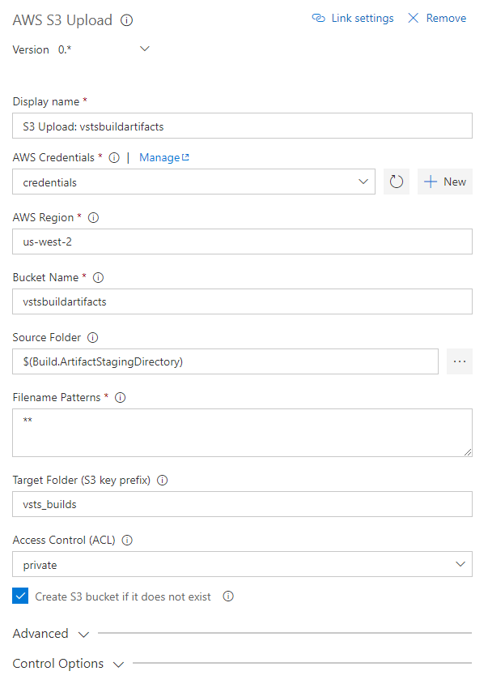
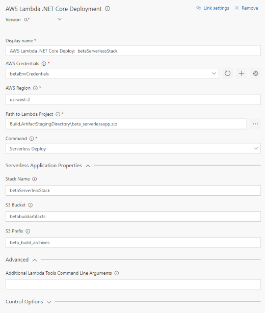
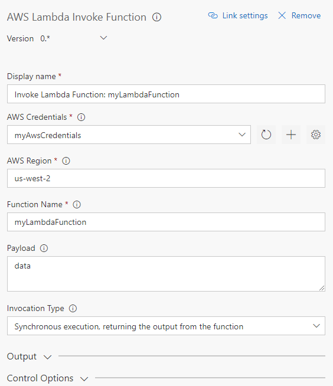
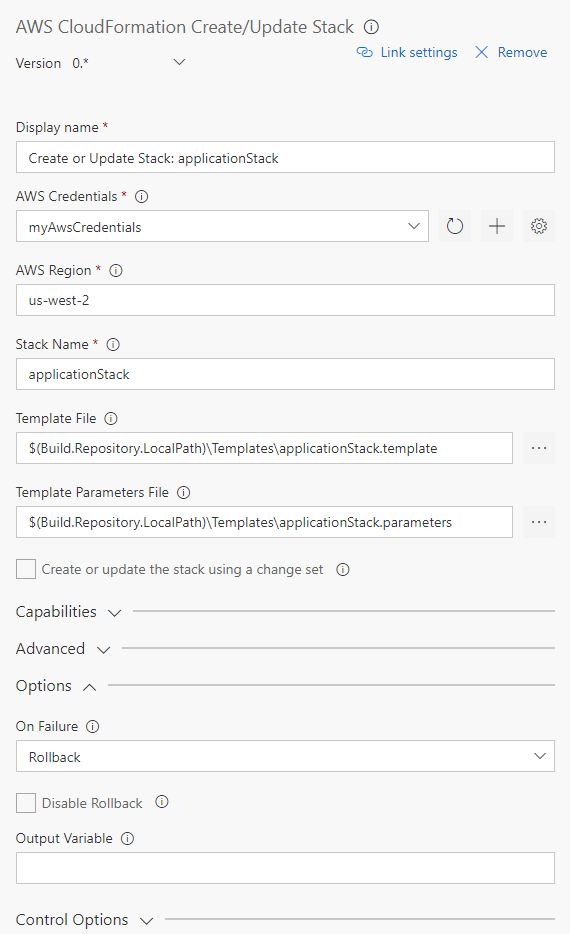
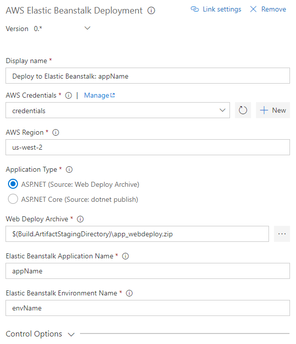
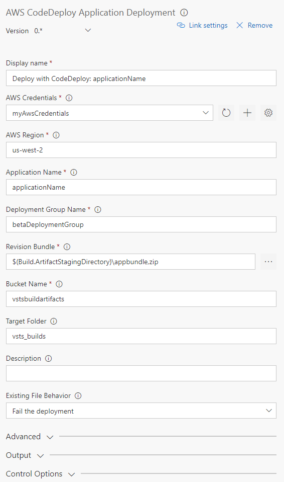
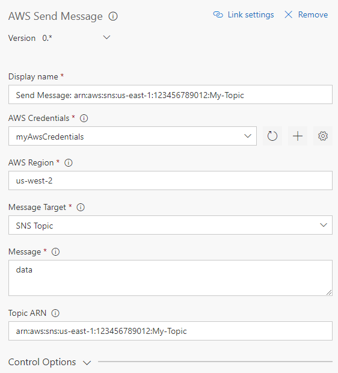
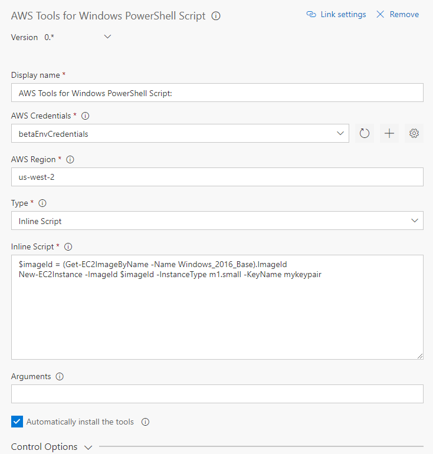
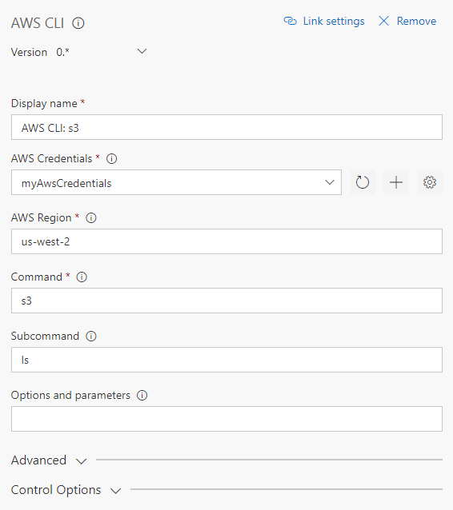
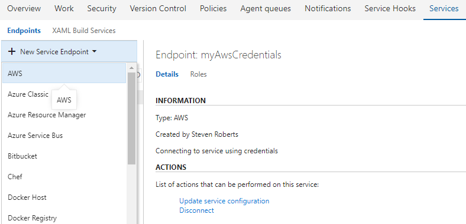

# Overview

System | Status
---|---
Build ([develop](https://github.com/aws/aws-vsts-tools/tree/develop) branch) | [
Build ([master](https://github.com/aws/aws-vsts-tools/tree/master) branch) | [

The AWS Tools for Microsoft Visual Studio Team Services (VSTS) adds tasks to easily enable build and release pipelines in VSTS and Team Foundation Server to work with AWS services including Amazon S3, AWS Elastic Beanstalk, AWS CodeDeploy, AWS Lambda, AWS CloudFormation, Amazon Simple Queue Service and Amazon Simple Notification Service, and run commands using the AWS Tools for Windows PowerShell module and the AWS CLI.

The AWS Tools for VSTS is available from the [Visual Studio Marketplace](https://marketplace.visualstudio.com/items?itemName=AmazonWebServices.aws-vsts-tools).

**Note for Team Foundation Server 2015 Users:** Team Foundation Server 2015 users should download the extension from [here](https://sdk-for-net.amazonwebservices.com/latest/amazonwebservices.aws-vsts-tools-tfs2015.vsix). This temporary version contains the same tasks as the version in the marketplace but removes the support for extra fields in the *AWS* endpoint type to support *Assume Role* credentials. These fields, although marked optional, are unfortunately treated as required in TFS 2015 editions.

## Highlighted Features

### Transfer Files to and from Amazon S3 Buckets

Upload files to an Amazon Simple Storage Service (S3) Bucket with the AWS S3 Upload task or download from a bucket with the AWS S3 Download task.

### Deploy .NET Core serverless applications or standalone functions to AWS Lambda

### Invoke an AWS Lambda Function

Invoke Lambda functions from within the build or release pipeline.

### Create/update AWS CloudFormation stacks

Create new AWS CloudFormation stacks or update an existing stack.

### Deploy to AWS Elastic Beanstalk

Deploy ASP.NET or ASP.NET Core applications to Elastic Beanstalk environments.

### Deploy to Amazon EC2 with AWS CodeDeploy

Deploy applications to EC2 instances using CodeDeploy.

### Send a message to an Simple Notification Service Topic or Simple Queue Service Queue

### Run AWS Tools for Windows PowerShell scripts

Run scripts using cmdlets from the AWS Tools for Windows PowerShell (AWSPowerShell) module, optionally installing the module before use.

### Run AWS CLI commands

Run AWS CLI commands against an AWS connection.

## Credentials Handling for AWS Services

To enable tasks to call AWS services when run as part of your build or release pipelines AWS credentials need to have been configured for the tasks or be available in the host process for the build agent. Note that the credentials are used specifically by the tasks when run in a build agent process, they are not related to end-user logins to your VSTS or TFS instance.

The AWS tasks support the following mechanisms for obtaining AWS credentials:

* One or more service endpoints, of type *AWS*, can be created and populated with AWS access and secret keys, and optionally data for *Assumed Role* credentials.
  * Tasks reference the configured service endpoint instances by name as part of their configuration and pull the required credentials from the endpoint when run.
* Variables defined on the task or build.
  * If tasks are not configured with the name of a service endpoint they will attempt to obtain credentials, and optionally region, from variables defined in the build environment. The
    variables are named *AWS.AccessKeyID*, *AWS.SecretAccessKey* and optionally *AWS.SessionToken*. To supply the ID of the region to make the call in, e.g. us-west-2, you can also use the variable *AWS.Region*.
* Environment variables in the build agent's environment.
  * If tasks are not configured with the name of a service endpoint, and credentials or region are not available from task variables, the tasks will attempt to obtain credentials, and optionally region, from standard environment variables in the build process environment. These variables are *AWS_ACCESS_KEY_ID*, *AWS_SECRET_ACCESS_KEY* and optionally *AWS_SESSION_TOKEN*. To supply the ID of the region to make the call in, e.g. us-west-2, you can also use the environment variable *AWS_REGION*.
* EC2 instance metadata, for build hosts running on EC2 instances.
  * Both credential and region information can be automatically obtained from the instance metadata in this scenario.

### Configuring an AWS Service Endpoint

To use *AWS* service endpoints add the AWS subscription(s) to use by opening the Account Administration screen (gear icon on the top-right of the screen) and then click on the Services Tab. Note that each VSTS/TFS project is associated with its own set of credentials. Service endpoints are not shared across projects. You can associate a single service endpoint to be used with all AWS tasks in a build or multiple endpoints if you require.

Select the *AWS* endpoint type and provide the following parameters. Please refer to [About Access Keys](https://aws.amazon.com/developers/access-keys/):

* A name used to refer to the credentials when configuring the AWS tasks
* AWS Access Key ID
* AWS Secret Access Key

**Note** We strongly suggest you use access and secret keys generated for an Identity and Access Management (IAM) user account. You can configure an IAM user account with permissions granting access to only the services and resources required to support the tasks you intend to use in your build and release definitions.

Tasks can also use assumed role credentials by adding the Amazon Resource name (ARN) of the role to be assumed and an optional identifier when configuring the endpoint. The access and secret keys specified will then be used to generate temporary credentials for the tasks when they are executed by the build agents. Temporary credentials are valid for up to 15 minutes by default. To enable a longer validity period you can set the 'aws.rolecredential.maxduration' variable on your build or release definition, specifying a validity period in seconds between 15 minutes (900 seconds) and one hour (3600 seconds).

## Build 

* To build for testing purposes, run `gulp build`
* To package for installation into VSTS, run `gulp package --publisherid <your-publisher-id-here> --release`

note: Due to [this bug](https://npm.community/t/npm-install-for-package-with-local-dependency-fails/754/2), Tasks/BeanstalkCreateApplicationVersion has a .npmrc file that disables package lock for this module. Without this, rebuild will not work.

## Minimum supported environments

* Visual Studio Team Services
* Team Foundation Server 2015 Update 3 (or higher)

## Contributors

We thank the following contributor(s) for this extension: Visual Studio ALM Rangers.
